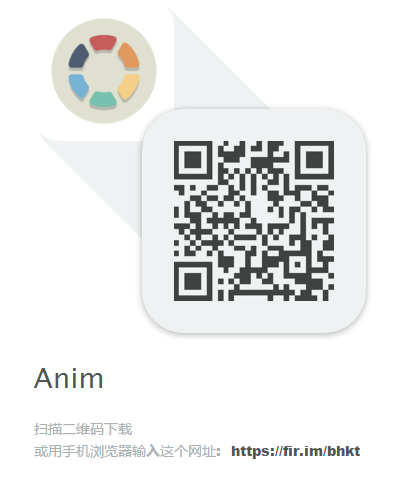
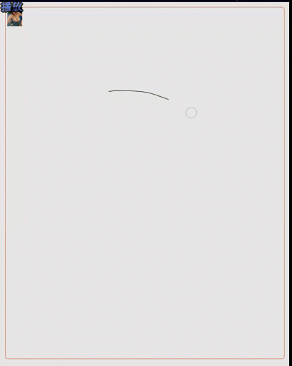
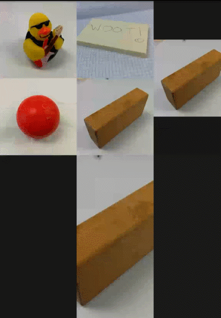
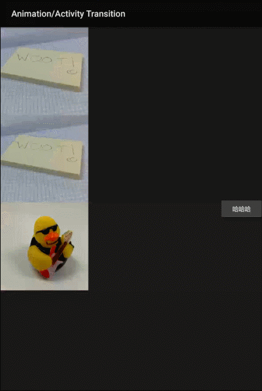

# AyoAnim
笔记 for：各种安卓动画； 集合 for：好看动画收集和仿写；库 for：动画便利库

apk下载：  


* 特别说明：
    * 本项目既是动画的学习笔记和demo
    * 也是收集了一些好看的好用的好玩的动画效果
    * 最主要的，就是一个通用动画库，本来之前一直用daimajia的ease和AndroidViewAnimation，但发现hujiaweibujidao的yava和wava代码更简洁
    * hujiawei ease：https://github.com/hujiaweibujidao/yava
    * hujiawei anim：https://github.com/hujiaweibujidao/wava
    * 代码家 ease：https://github.com/daimajia/AnimationEasingFunctions
    * 代码家 anim：https://github.com/daimajia/AndroidViewAnimations
    * 注意：hujiawei的代码是代码家的衍生，是改进，而不是再造的轮子
    * 像Flyco提供了一组控件库，挺好用，但动画特效确实基于他们自己的一个库，太不统一了，这种情况以后要避免，谁用谁自己避免
    * hujiawei这个怎么都好，就是名字不讲究，其实给开源项目起名字，是很重要的
    * 另外注意：nineold都将被剔除，不再考虑

* 关于animator库
    * 在ayo-animate里
    * ease包下是hujiawei的ease库，只不过我改了一下
    * 为什么改，为了和YoYo结构一样，一组子类代表效果，一个枚举整合


## 1 动画基本概念

这里我们从ValueAnimator出发，来说说TypeEvaluator和TimeInterpolator

首先要明白，动画就是组件的某个属性从一个值到另一个值的变化过程，在变化的持续时间内，属性值产生一系列的连续变化，  
将这些属性值作用于组件上，就看到了动画效果    

ValueAnimator决定了：每一帧在哪里取，取多少帧  
TimeInterpolator：插值器的输入是时间变化率，其实就是时间，输出的是根据时间变化率得到的属性值变化率  
所以如果使用LinearInterpolator，时间变化率和属性值变化率就是线性关系，相当于跳过了Interpolator计算过程  
TypeEvaluator：估值器是根据属性值的变化率计算真正的属性值，这取决于属性值的类型，int，float，color等  
默认的IntEvaluator,FloatEvaluator，是最典型的行为，我们也可以认为这种行为相当于跳过了Evaluate过程  

### 1 TimeInterpolator和TypeEvaluator

先来说说插值器的基本用法，注意,下面代码中的两个动画效果是一样的

```java
ValueAnimator animator1 = new ValueAnimator();
animator1.setFloatValues(0.0f, 1.0f);
animator1.setDuration(1000);
animator1.setInterpolator(new LinearInterpolator());//传入null也是LinearInterpolator
animator1.setEvaluator(new TypeEvaluator() {
    @Override
    public Object evaluate(float fraction, Object startValue, Object endValue) {
        return 100 * fraction;
    }
});
animator1.addUpdateListener(new ValueAnimator.AnimatorUpdateListener() {
    @Override
    public void onAnimationUpdate(ValueAnimator animation) {
        Log.e("demo 1", "" + animation.getAnimatedValue());
    }
});

ValueAnimator animator2 = new ValueAnimator();
animator2.setFloatValues(0.0f, 1.0f);
animator2.setDuration(1000);
animator2.setInterpolator(new Interpolator() {
    @Override
    public float getInterpolation(float input) {
        return 100 * input;
    }
});
animator2.setEvaluator(new TypeEvaluator() {
    @Override
    public Object evaluate(float fraction, Object startValue, Object endValue) {
        return fraction;
    }
});
animator2.addUpdateListener(new ValueAnimator.AnimatorUpdateListener() {
    @Override
    public void onAnimationUpdate(ValueAnimator animation) {
        Log.e("demo 2", "" + animation.getAnimatedValue());
    }
});

animator1.start();
animator2.start();
```


安卓内置的Evaluator
```java

public class FloatEvaluator implements TypeEvaluator {  
    public Object evaluate(float fraction, Object startValue, Object endValue) {  
        float startFloat = ((Number) startValue).floatValue();  
        return startFloat + fraction * (((Number) endValue).floatValue() - startFloat);  
    }  
}  

还有个IntEvaluator IntArrayEvalulator
还有个FloatArrayEvaluator

```

int，float的Evaluator还好理解，还有个ObjectEvaluator，对象的值怎么过渡呢，例如Point的过渡  
理解了这个有助于后面理解Path动画，因为动画所动的是在Path上的下一帧位置
```java
public class Point {  
  
    private float x;  
  
    private float y;  
  
    public Point(float x, float y) {  
        this.x = x;  
        this.y = y;  
    }  
  
    public float getX() {  
        return x;  
    }  
  
    public float getY() {  
        return y;  
    }  
  
}  

public class PointEvaluator implements TypeEvaluator{  
  
    @Override  
    public Object evaluate(float fraction, Object startValue, Object endValue) {  
        Point startPoint = (Point) startValue;  
        Point endPoint = (Point) endValue;  
        float x = startPoint.getX() + fraction * (endPoint.getX() - startPoint.getX());  
        float y = startPoint.getY() + fraction * (endPoint.getY() - startPoint.getY());  
        Point point = new Point(x, y);  
        return point;  
    }  
  
}  

//应用Point：这个只是平移
//如果两点之间是一段曲线，道理也一样，不过需要其他套路了
Point point1 = new Point(0, 0);  
Point point2 = new Point(300, 300);  
ValueAnimator anim = ValueAnimator.ofObject(new PointEvaluator(), point1, point2);  
anim.setDuration(5000);  
anim.start();  
```


Color，也就是Argb的估值器：
```java
public class ColorEvaluator implements TypeEvaluator {  
  
    private int mCurrentRed = -1;  
  
    private int mCurrentGreen = -1;  
  
    private int mCurrentBlue = -1;  
  
    @Override  
    public Object evaluate(float fraction, Object startValue, Object endValue) {  
        String startColor = (String) startValue;  
        String endColor = (String) endValue;  
        int startRed = Integer.parseInt(startColor.substring(1, 3), 16);  
        int startGreen = Integer.parseInt(startColor.substring(3, 5), 16);  
        int startBlue = Integer.parseInt(startColor.substring(5, 7), 16);  
        int endRed = Integer.parseInt(endColor.substring(1, 3), 16);  
        int endGreen = Integer.parseInt(endColor.substring(3, 5), 16);  
        int endBlue = Integer.parseInt(endColor.substring(5, 7), 16);  
        // 初始化颜色的值  
        if (mCurrentRed == -1) {  
            mCurrentRed = startRed;  
        }  
        if (mCurrentGreen == -1) {  
            mCurrentGreen = startGreen;  
        }  
        if (mCurrentBlue == -1) {  
            mCurrentBlue = startBlue;  
        }  
        // 计算初始颜色和结束颜色之间的差值  
        int redDiff = Math.abs(startRed - endRed);  
        int greenDiff = Math.abs(startGreen - endGreen);  
        int blueDiff = Math.abs(startBlue - endBlue);  
        int colorDiff = redDiff + greenDiff + blueDiff;  
        if (mCurrentRed != endRed) {  
            mCurrentRed = getCurrentColor(startRed, endRed, colorDiff, 0,  
                    fraction);  
        } else if (mCurrentGreen != endGreen) {  
            mCurrentGreen = getCurrentColor(startGreen, endGreen, colorDiff,  
                    redDiff, fraction);  
        } else if (mCurrentBlue != endBlue) {  
            mCurrentBlue = getCurrentColor(startBlue, endBlue, colorDiff,  
                    redDiff + greenDiff, fraction);  
        }  
        // 将计算出的当前颜色的值组装返回  
        String currentColor = "#" + getHexString(mCurrentRed)  
                + getHexString(mCurrentGreen) + getHexString(mCurrentBlue);  
        return currentColor;  
    }  
  
    /** 
     * 根据fraction值来计算当前的颜色。 
     */  
    private int getCurrentColor(int startColor, int endColor, int colorDiff,  
            int offset, float fraction) {  
        int currentColor;  
        if (startColor > endColor) {  
            currentColor = (int) (startColor - (fraction * colorDiff - offset));  
            if (currentColor < endColor) {  
                currentColor = endColor;  
            }  
        } else {  
            currentColor = (int) (startColor + (fraction * colorDiff - offset));  
            if (currentColor > endColor) {  
                currentColor = endColor;  
            }  
        }  
        return currentColor;  
    }  
      
    /** 
     * 将10进制颜色值转换成16进制。 
     */  
    private String getHexString(int value) {  
        String hexString = Integer.toHexString(value);  
        if (hexString.length() == 1) {  
            hexString = "0" + hexString;  
        }  
        return hexString;  
    }  
  
}  

///使用
ObjectAnimator anim = ObjectAnimator.ofObject(myAnimView, "color", new ColorEvaluator(),   
    "#0000FF", "#FF0000");  
anim.setDuration(5000);  
anim.start();  
```

* 总结：  
    * 插值器根据时间流逝，计算出动画流逝fraction，例如duration是10秒，时间过了5秒，但fraction是0.2，表示前五秒是慢速运行的，而后5秒，需要走完0.8，所以是加速的
        * 所以插值器管的应该是速度，但fraction也可以是负值，即在初始值之前，或者结束值之后，以此可以产生晃动效果
        * 你应该问插值器，时间已过5秒，动画的进度是多少了？
    * 估值器根据动画流逝，计算出这一帧的属性值，属性可能是int，float这种值类型，也可能是Color，也可能Point和Path的关系计算
        * 所以估值器管的是这一帧的属性值，你应该问估值器，动画进度已经过了0.2了（fraction），这时的属性值应该是多少
    * 所以如果是Linear的插值器，时间流逝即动画进度，则所有处理进度的逻辑，和计算属性值的逻辑，都可以交给估值器来算

基于上面的示例，其实daimajia的开源项目AnimationEasingFunctions，也是基于Evaluator的  
而hujiawei的ease库，同时支持插值用法和估值用法


## 2 ease库用法

ease库是取自：
https://github.com/hujiaweibujidao/yava

```java

///枚举用法：as Evaluator
ObjectAnimator animator1 = new ObjectAnimator();
animator1.setTarget(textView1);
animator1.setPropertyName("translationY");
animator1.setFloatValues(0f, -100f);
animator1.setDuration(1000);

animator1.setInterpolator(new LinearInterpolator());
animator1.setEvaluator(EasingFunction.BOUNCE_OUT.getEasingFunction()); //use `EasingFunction.BOUNCE_OUT` as `TypeEvaluator`
animator1.start();


///枚举用法：as Interpolator
ObjectAnimator animator2 = new ObjectAnimator();
animator2.setTarget(textView2);
animator2.setPropertyName("translationY");
animator2.setFloatValues(0f, -100f);
animator2.setDuration(1000);

animator2.setInterpolator(EasingFunction.BOUNCE_OUT.getEasingFunction()); //use `EasingFunction.BOUNCE_OUT` as `Interpolator`
animator2.setEvaluator(new FloatEvaluator());

animator2.start();

///自定义ease函数（也支持插值用法和估值用法）
ObjectAnimator animator1 = new ObjectAnimator();
animator1.setTarget(textView1);
animator1.setPropertyName("translationY");
animator1.setFloatValues(0f, -100f);
animator1.setDuration(1000);

animator1.setInterpolator(new LinearInterpolator());
animator1.setEvaluator(EasingFunction.with(new IFunction() { //customized TypeEvaluator
    @Override
    public float getValue(float input) {
        return input * 2 + 3;
    }
}));

animator1.start();

///如何支持ColorEvaluator或者ARGBEvaluator


```

安卓内置的几个插值器：
```java

TimeInterpolator   --> Interpolator --> BaseInterpolator

LinearInterpolator
AccelerateInterpolator：开始慢，后面快
DecelerateInterpolator
AccelerateDecelerateInterpolator：开始慢，结束慢，中间快
AnticipateInterpolator
OvershootInterpolator
AnticipateOvershootInterpolator
BounceInterpolator
CycleInterpolator

PathInterpolator

```

安卓内置的几个估值器：
```java
TypeEvaluator

ArgbEvaluator
FloatEvaluator
FloatArrayEvaluator
IntEvaluator
IntArrayEvaluator
PointFEvaluator
RectEvaluator


```

## 3 YoYo库用法：属性动画

```java
YoYoString rope =  YoYo.with(Techniques.FadeIn).duration(duration)
                .interpolate(Functions.Accelerate)
                .listen(new AnimatorListenerAdapter() {
                    @Override
                    public void onAnimationCancel(Animator animation) {
                        Toast.makeText(DemoYoyoActivity.this, "取消了", Toast.LENGTH_SHORT).show();
                    }
                })
                .playOn(mTarget);
                
//停止动画
rope.stop(); 
```


## 4 帧动画

多个图片配合形成动画，类似gif图，众所周知比较耗费资源，但有时也是最有效的

这里只说说用法

```
//在res/drawable，创建anim1.xml
<?xml version="1.0" encoding="utf-8"?>
<!-- 
	根标签为animation-list，其中oneshot代表着是否只展示一遍，设置为false会不停的循环播放动画
	根标签下，通过item标签对动画中的每一个图片进行声明
	android:duration 表示展示所用的该图片的时间长度
 -->
<animation-list
  xmlns:android="http://schemas.android.com/apk/res/android"
  android:oneshot="true"
  >
  	<item android:drawable="@drawable/icon1" android:duration="150"></item>
  	<item android:drawable="@drawable/icon2" android:duration="150"></item>
  	<item android:drawable="@drawable/icon3" android:duration="150"></item>
  	<item android:drawable="@drawable/icon4" android:duration="150"></item>
  	<item android:drawable="@drawable/icon5" android:duration="150"></item>
  	<item android:drawable="@drawable/icon6" android:duration="150"></item>
</animation-list>

将其作为ImageView的src属性，或者其他控件的background属性
<ImageView android:id="@+id/animationIV"
    android:layout_width="wrap_content"
    android:layout_height="wrap_content"
    android:padding="5px"
    android:src="@drawable/animation1"/>
     
Java代码
iv.setImageResource(R.drawable.animation1);
animationDrawable = (AnimationDrawable) animationIV.getDrawable();
animationDrawable.start();
 
```


## 5 补间动画

* View动画：
    * 平移：TranslateAnimation
    * 透明度：AlphaAnimation
    * 旋转：RotateAnimation
    * 缩放：ScaleAnimation
    * 无论如何移动原View，View始终占据原先的位置，在新位置点击也不会触发点击事件

### 5.1 入门

在Java代码中创建动画
```java

///-----------------平移
TranslateAnimation(int fromXType, float fromXValue, int toXType, float toXValue,
            int fromYType, float fromYValue, int toYType, float toYValue)
fromXType    ：在X轴上动画相对于谁移动，一般是相对于父控件Animation.RELATIVE_TO_PARENT，或者相对于自己移动Animation.RELATIVE_TO_SELF
fromXValue    ：在X轴上的起始时的移动距离，一般为0f，即原来位置
toXType        ：在结束时X轴相对于谁移动，同fromXType
toXValue    ：在结束时动画X轴所处的距离，若相对于父控件移动，一般不超多1.0f，否则会移动到屏幕外面
fromYType    ：在Y轴上动画相对于谁移动，一般是相对于父控件Animation.RELATIVE_TO_PARENT，或者相对于自己移动Animation.RELATIVE_TO_SELF
fromYValue    ：在Y轴上的起始时的移动距离，一般为0f，即原来位置
toYType        ：在结束时Y轴相对于谁移动，同fromXType
toYValue    ：在结束时动画Y轴所处的距离，若相对于父控件移动，一般不超多1.0f，否则会移动到屏幕外面

//相对于父控件，往右下角45度移动的示例
TranslateAnimation trans = new TranslateAnimation(
        Animation.RELATIVE_TO_PARENT, 0f,    // 起始时X轴相对于父控件移动
        Animation.RELATIVE_TO_PARENT, 0.2f,     // 结束时X轴也相对于父控件移动
        Animation.RELATIVE_TO_PARENT, 0,    // 起始时Y轴相对于父控件移动
        Animation.RELATIVE_TO_PARENT, 0.2f);    // 结束时Y轴相对于父控件移动
trans.setDuration(2000);
imageView.startAnimation(trans);

///-----------------透明度
//1.0意味着着完全不透明 0.0意味着完全透明
AlphaAnimation aa = new AlphaAnimation(1.0f, 0.0f);
aa.setDuration(2000); //设置动画执行的时间
aa.setRepeatCount(1); //设置重复的次数
aa.setRepeatMode(Animation.REVERSE);//设置动画执行的模式
//imageView开始执行动画 
imageView.startAnimation(aa);

///-----------------旋转
RotateAnimation(float fromDegrees, float toDegrees, int pivotXType, float pivotXValue,
        int pivotYType, float pivotYValue)
fromDegrees ： 从哪个角度开始旋转，一般为0
toDegrees    ： 结束的时候角度为多少，如转一圈则为360
pivotXType    ： 在X轴上动画相对于谁旋转，一般是相对于父控件Animation.RELATIVE_TO_PARENT，或者相对于自己旋转Animation.RELATIVE_TO_SELF
pivotXValue    ： 在X轴上动画旋转的中心点
pivotYType    ： 在Y轴上动画相对于谁旋转，同pivotXType
pivotYValue    ： 在Y轴上动画旋转的中心点

//以imageView的中心点旋转360度回到原点
RotateAnimation rotate = new RotateAnimation(0, 360, // 从0度开始旋转，到360度结束
        Animation.RELATIVE_TO_SELF, 0.5f,     // X轴指定相对于自己还是相对于父控件旋转，0.5f则是以自己宽度的二分之一为旋转点
        Animation.RELATIVE_TO_SELF, 0.5f);    // Y轴指定相对于自己还是相对于父控件旋转，0.5f则是以自己高度的二分之一为旋转点
rotate.setDuration(2000);
imageView.startAnimation(rotate);

///-----------------缩放
ScaleAnimation(float fromX, float toX, float fromY, float toY,
            int pivotXType, float pivotXValue, int pivotYType, float pivotYValue)
fromX    ： 动画的X轴从多大开始缩放，一般为1.0f，即动画原本大小开始缩放
toX        ： 动画在X轴方向上要缩放到多大，如果小于1.0f，则动画在X轴上的距离会变小，大于1.0f会放大
fromY    ： 动画的Y轴从多大开始缩放,其他同fromX
toY        ： 动画在Y轴方向上要缩放到多大，其他同toX
pivotXType    ： X轴指定相对于自己还是相对于父控件缩放，一般是相对于父控件Animation.RELATIVE_TO_PARENT，或者相对于自己缩放Animation.RELATIVE_TO_SELF
pivotXValue    ： 指定X轴方向上哪个位置为中心缩放
pivotYType    ： Y轴同pivotXType
pivotYValue    ： Y轴同pivotXValue

//相对于自己从中心点放大
ScaleAnimation scale = new ScaleAnimation(1.0f, 2.0f, 1.0f, 2.0f,     // 1.0f代表原本大小，2.0f代表放大一倍
        Animation.RELATIVE_TO_SELF, 0.5f, // X轴指定相对于自己还是相对于父控件放大，第二个则是以哪个位置为X轴的旋转点，此处为中心点放大
        Animation.RELATIVE_TO_SELF, 0.5f);
scale.setDuration(2000);
imageView.startAnimation(scale);
```


在xml中创建动画
```
//Java代码加载xml动画
Animation translate = AnimationUtils.loadAnimation(getApplicationContext(), R.anim.translate);
//开始动画
iv.startAnimation(translate);

//在anim目录下

<?xml version="1.0" encoding="utf-8"?>
<translate
    android:fromXDelta="0%p"    // 起始位置为原来的位置，后面带P代表相对于父控件移动，即代码布局中的Animation.RELATIVE_TO_PARENT
    android:toXDelta="0%p"
    android:fromYDelta="0%p"
    android:toYDelta="20%p"            
    android:fillAfter="true"
    android:duration="2000"
    xmlns:android="http://schemas.android.com/apk/res/android">

</translate>

```


动画集合

### 5.2 自定义补间动画

主要是Matrix和Camera的使用，所以有点麻烦，下面以ApiDemo里的Rotate3D代码为例

```

import android.view.animation.Animation;
import android.view.animation.Transformation;
import android.graphics.Camera;
import android.graphics.Matrix;

/**
 * An animation that rotates the view on the Y axis between two specified angles.
 * This animation also adds a translation on the Z axis (depth) to improve the effect.
 */
public class Rotate3dAnimation extends Animation {
    private final float mFromDegrees;
    private final float mToDegrees;
    private final float mCenterX;
    private final float mCenterY;
    private final float mDepthZ;
    private final boolean mReverse;
    private Camera mCamera;

    /**
     * Creates a new 3D rotation on the Y axis. The rotation is defined by its
     * start angle and its end angle. Both angles are in degrees. The rotation
     * is performed around a center point on the 2D space, definied by a pair
     * of X and Y coordinates, called centerX and centerY. When the animation
     * starts, a translation on the Z axis (depth) is performed. The length
     * of the translation can be specified, as well as whether the translation
     * should be reversed in time.
     *
     * @param fromDegrees the start angle of the 3D rotation
     * @param toDegrees the end angle of the 3D rotation
     * @param centerX the X center of the 3D rotation
     * @param centerY the Y center of the 3D rotation
     * @param reverse true if the translation should be reversed, false otherwise
     */
    public Rotate3dAnimation(float fromDegrees, float toDegrees,
            float centerX, float centerY, float depthZ, boolean reverse) {
        mFromDegrees = fromDegrees;
        mToDegrees = toDegrees;
        mCenterX = centerX;
        mCenterY = centerY;
        mDepthZ = depthZ;
        mReverse = reverse;
    }

    @Override
    public void initialize(int width, int height, int parentWidth, int parentHeight) {
        super.initialize(width, height, parentWidth, parentHeight);
        mCamera = new Camera();
    }

    @Override
    protected void applyTransformation(float interpolatedTime, Transformation t) {
        final float fromDegrees = mFromDegrees;
        float degrees = fromDegrees + ((mToDegrees - fromDegrees) * interpolatedTime);

        final float centerX = mCenterX;
        final float centerY = mCenterY;
        final Camera camera = mCamera;

        final Matrix matrix = t.getMatrix();

        camera.save();
        if (mReverse) {
            camera.translate(0.0f, 0.0f, mDepthZ * interpolatedTime);
        } else {
            camera.translate(0.0f, 0.0f, mDepthZ * (1.0f - interpolatedTime));
        }
        camera.rotateY(degrees);
        camera.getMatrix(matrix);
        camera.restore();

        matrix.preTranslate(-centerX, -centerY);
        matrix.postTranslate(centerX, centerY);
    }
}

```

## 6 属性动画

### 6.1 属性动画

```java
///平移
//先移动到10，然后继续向右移动到50，在向左移动到20，最后移动到100的位置
ObjectAnimator oa = ObjectAnimator.ofFloat(imageView, "translationX", 10, 50, 20, 100);
oa.setDuration(2000);
oa.start(); //开始动画

///旋转
ObjectAnimator oa = ObjectAnimator.ofFloat(imageView, "rotationX", 0, 180, 90, 360);
oa.setDuration(2000);
oa.start();

///透明度
ObjectAnimator oa = ObjectAnimator.ofFloat(imageView, "alpha", 0, 0.5f, 0, 1,0,1);
oa.setDuration(2000);
oa.start();

///缩放
ObjectAnimator oa = ObjectAnimator.ofFloat(imageView, "scaleY", 0, 0.5f, 0, 1,0,1);
oa.setDuration(2000);
oa.start();

///动画并行或者串行
AnimatorSet as = new AnimatorSet();
ObjectAnimator oa = ObjectAnimator.ofFloat(imageView, "translationX", 10, 50, 20, 100);
ObjectAnimator oa2 = ObjectAnimator.ofFloat(imageView, "scaleY", 0.1f, 2, 1, 2);
ObjectAnimator oa3 = ObjectAnimator.ofFloat(imageView, "alpha", 0, 0.5f, 0, 1);
ObjectAnimator oa4 = ObjectAnimator.ofFloat(imageView, "rotationY", 0, 180, 90, 360);
as.setDuration(2000);//执行动画时长
as.setTarget(iv);//iv执行动画
//往集合中添加动画
//动画逐个执行
as.playSequentially(oa, oa2, oa3, oa4);
//动画全部一起执行
//as.playTogether(oa, oa2, oa3, oa4);
as.start();

///动画组合
after(Animator anim)   将现有动画插入到传入的动画之后执行
after(long delay)   将现有动画延迟指定毫秒后执行
before(Animator anim)   将现有动画插入到传入的动画之前执行
with(Animator anim)   将现有动画和传入的动画同时执行

ObjectAnimator moveIn = ObjectAnimator.ofFloat(textview, "translationX", -500f, 0f);  
ObjectAnimator rotate = ObjectAnimator.ofFloat(textview, "rotation", 0f, 360f);  
ObjectAnimator fadeInOut = ObjectAnimator.ofFloat(textview, "alpha", 1f, 0f, 1f);  
AnimatorSet animSet = new AnimatorSet();  
animSet.play(rotate).with(fadeInOut).after(moveIn);  
animSet.setDuration(5000);  
animSet.start();  

///监听
anim.addListener(new AnimatorListener() {  
    @Override  
    public void onAnimationStart(Animator animation) {  
    }  
  
    @Override  
    public void onAnimationRepeat(Animator animation) {  
    }  
  
    @Override  
    public void onAnimationEnd(Animator animation) {  
    }  
  
    @Override  
    public void onAnimationCancel(Animator animation) {  
    }  
});  

anim.addListener(new AnimatorListenerAdapter() {    ///这个是基类，对所有方法提供了一个空实现，方便
    @Override  
    public void onAnimationEnd(Animator animation) {  
    }  
}); 

///取消，清除等

```

在xml里设置属性动画
```xml
//java代码加载动画
ObjectAnimator oa = (ObjectAnimator) AnimatorInflater.loadAnimator(this, R.animator.oanimator);
//设置执行目标
oa.setTarget(iv);
oa.start();//开始执行

res/animator下
<?xml version="1.0" encoding="utf-8"?>
<animator xmlns:android="http://schemas.android.com/apk/res/android" >
    <objectAnimator 
        android:propertyName="translationX"
        android:duration="2000"
        android:valueFrom="10"
        android:valueTo="100"
        ></objectAnimator>
</animator>


<?xml version="1.0" encoding="utf-8"?>
<objectAnimator xmlns:android="http://schemas.android.com/apk/res/android"  
    android:valueFrom="1"  
    android:valueTo="0"  
    android:valueType="floatType"  
    android:propertyName="alpha"/>  


<?xml version="1.0" encoding="utf-8"?>
<set xmlns:android="http://schemas.android.com/apk/res/android"  
    android:ordering="sequentially" >  
  
    <objectAnimator  
        android:duration="2000"  
        android:propertyName="translationX"  
        android:valueFrom="-500"  
        android:valueTo="0"  
        android:valueType="floatType" >  
    </objectAnimator>  
  
    <set android:ordering="together" >  
        <objectAnimator  
            android:duration="3000"  
            android:propertyName="rotation"  
            android:valueFrom="0"  
            android:valueTo="360"  
            android:valueType="floatType" >  
        </objectAnimator>  
  
        <set android:ordering="sequentially" >  
            <objectAnimator  
                android:duration="1500"  
                android:propertyName="alpha"  
                android:valueFrom="1"  
                android:valueTo="0"  
                android:valueType="floatType" >  
            </objectAnimator>  
            <objectAnimator  
                android:duration="1500"  
                android:propertyName="alpha"  
                android:valueFrom="0"  
                android:valueTo="1"  
                android:valueType="floatType" >  
            </objectAnimator>  
        </set>  
    </set>  
  
</set>  
```


ValueAnimator的用法：
```java
ValueAnimator anim = ValueAnimator.ofFloat(0f, 1f);  
anim.setDuration(300);  
anim.addUpdateListener(new ValueAnimator.AnimatorUpdateListener() {  
    @Override  
    public void onAnimationUpdate(ValueAnimator animation) {  
        float currentValue = (float) animation.getAnimatedValue();  
        Log.d("TAG", "cuurent value is " + currentValue);  ///0到1
    }  
});  
anim.start();  

从0到100平滑过渡
<animator xmlns:android="http://schemas.android.com/apk/res/android"  
    android:valueFrom="0"  
    android:valueTo="100"  
    android:valueType="intType"/>  
```

常用属性：
```java
setStartDelay()：设置动画延迟播放的时间
setRepeatCount()：动画循环播放的次数
setRepeatMode()：循环播放的模式，RESTART和REVERSE，重新播放和倒序播放
```

相比ValueAnimator，ObjectAnimator直接提供了调用属性set方法的功能


ViewPropertyAnimator：这个是对ObjectAnimator的封装  
为啥需要这个？因为3.0引入的属性动画已经不是针对View设计的了，虽然我们一般也就用于View  
但就算用ObjectAnimator还是略显复杂，所以3.1引入了这个ViewPropertyAnimator

```java
textview.animate().alpha(0f);  
textview.animate().x(500).y(500);  
textview.animate().x(500).y(500).setDuration(5000);  
textview.animate().x(500).y(500).setDuration(5000).setInterpolator(new BounceInterpolator());  


使用ViewPropertyAnimator时，我们自始至终没有调用过start()方法，这是因为新的接口中使用了隐式启动动画的功能，
只要我们将动画定义完成之后，动画就会自动启动。并且这个机制对于组合动画也同样有效，只要我们不断地连缀新的方法，
那么动画就不会立刻执行，等到所有在ViewPropertyAnimator上设置的方法都执行完毕后，动画就会自动启动。当然如果
不想使用这一默认机制的话，我们也可以显式地调用start()方法来启动动画
```


### 6.2 Path动画

https://my.oschina.net/ososchina/blog/677307
http://m.2cto.com/kf/201503/380377.html

看看效果吧先，Path动画就是让控件跟着一个Path指定的路径走  


## 7 Transition

http://blog.jobbole.com/62601/
http://www.open-open.com/lib/view/open1477879867267.html

Transiton是在5.0之后，也就是21，也就是Build.VERSION_CODES.LOLLIPOP引入的  
之前的版本只能用Activity的overridePendingTransition()和Fragment的setCustomAnimation()来实现Activity或者Fragment之间的动画切换  

* 关于Activity的overridePendingTransition()和Fragment的setCustomAnimation()
    * 是将整个页面一起动画变换，比较生硬
    * 但是用起来比较简单
    * 而且动画太多，Transition哪儿哪儿都特别华丽，应用又会显得华而不实
    * 这里面有个度

* 关于Transition
    * 界面A打开界面B，Transition可以让A和B之间有一定的关联性
    * 可能是A和B共享同一个元素
    * 或者B动画开始的位置是基于我们在A中设置的值

### 7.1 主题设置

要使用Transition进行Activity之间的动画变换时，首先需要设置：
```
//设置允许通过ActivityOptions.makeSceneTransitionAnimation发送或者接收Bundle
getWindow().requestFeature(Window.FEATURE_ACTIVITY_TRANSITIONS);
//设置使用TransitionManager进行动画，不设置的话系统会使用一个默认的TransitionManager
getWindow().requestFeature(Window.FEATURE_CONTENT_TRANSITIONS);
```

也可以像ApiDemo里那样设置theme：
```
<style name="ActivityTransitionTheme" parent="android:Theme.Material" tools:targetApi="lollipop">
    <item name="android:windowEnterTransition">@transition/explode</item>
    <item name="android:windowExitTransition">@transition/explode</item>
    <item name="android:windowSharedElementEnterTransition">@transition/move_image</item>
    <item name="android:windowSharedElementExitTransition">@transition/move_image</item>
    <item name="android:windowAllowReturnTransitionOverlap">true</item>
    <item name="android:windowAllowEnterTransitionOverlap">false</item>
</style>

<activity android:name=".transition.ActivityTransition"
    android:label="Animation/Activity Transition"
    android:theme="@style/ActivityTransitionTheme">
    <intent-filter>
        <action android:name="android.intent.action.MAIN" />
        <category android:name="android.intent.category.SAMPLE_CODE" />
    </intent-filter>
</activity>
```


### 7.2 动画设置

* Transition有4种变换：如果从A打开B
    * 退出(exit)   A.getWindow().setExitTransition(new Fade());
    * 进入(enter)  B.getWindow().setEnterTransition(new Slide());
    * 返回(return) 此时再从B返回到A，B此时又有个动画，B.getWindow().setReturnTransition(new Fade());
    * 再次进入(reenter) 回到A了，A又有个动画，A.getWindow().setReenterTransition(new Explode());
    

### 7.3 动画效果
    
* 包括：
    * Fade(淡出)
    * Explode(分解)
    * Slide(滑动)
    * 系统会默认为其设置Fade动画效果
    
### 7.4 打开界面

```
//不传参数
Intent intent = new Intent(MainActivityA.this, MainActivityB.class);
ActivityOptions option = ActivityOptions.makeSceneTransitionAnimation(MainActivityA.this);
startActivity(intent, option.toBundle());

//传参数
Intent intent = new Intent(this, ActivityTransitionDetails.class);
intent.putExtra(KEY_ID, v.getTransitionName());
ActivityOptions activityOptions = ActivityOptions.makeSceneTransitionAnimation(this, mHero, "hero"); //mHero是ImageView
startActivity(intent, activityOptions.toBundle());
```

### 7.5 第一种效果：直接Transition

行了，到这罗列了不少东西了，该看看效果了  
```
界面1：
getWindow().setExitTransition(new Fade());
getWindow().setReenterTransition(new Explode());
getWindow().setEnterTransition(new Slide());
getWindow().setReturnTransition(new Fade());


界面2：
getWindow().setExitTransition(new Fade());
getWindow().setReenterTransition(new Explode());
getWindow().setEnterTransition(new Slide());
getWindow().setReturnTransition(new Fade());

```

上图：  


差不多能看出来，Transition框架会把布局切割成单独的部分，然后对每一个部分应用Fade，Explode，Slide效果  

* 大体是怎么切割出单独部分的呢？
    * 应该是从DecoreView开始的
    * 只要有ViewGroup包的，就往下切割
    * 直到切割到一个ViewGroup下面不会再有ViewGroup，这一组就会成为一个单独的部分
    * 和ViewGroup平级的也可能是一个View，这个View也会成为一个单独的部分
    * 例如LinearLayout包含RelativeLayout和一个ImageView，RelativeLayout下只有View
    * 这个RelativeLayout和ImageView会被切割成两个单独的部分
    
### 7.6 第二种效果：共享元素变换

界面A打开界面B，A中的一个ImageView会在B中放大显示，这就是ApiDemo里提供的例子  

这个效果跟上面的Slide，Fade，Explode是不冲突的，挺好

第一步：  
在A和B的布局文件中，给两个ImageView的transitionName属性设置成一样的值，这是必须的  
android:transitionName="ducky"

第二步：  
打开界面时，在ActivityOptions.makeSceneTransitionAnimation中将需要共享的元素作为参数传递过去
```
Intent intent = new Intent(MainActivityA.this, MainActivityB.class);
ActivityOptions option = ActivityOptions.makeSceneTransitionAnimation(MainActivityA.this,imageView,"ducky");
startActivity(intent, option.toBundle());

ActivityOptions.makeSceneTransitionAnimation(MainActivityA.this,imageView,"ducky");
这里的参数2和3表示：transitionName值为ducky的控件需要共享，在A中就是imageView，在B中你也能根据transitionName找到

//多个元素共享：
ActivityOptions option = ActivityOptions.makeSceneTransitionAnimation(MainActivityA.this,
            Pair.create(imageView, "share_image"),
            Pair.create(button, "share_button"));
```

效果就是：A中的ImageView会从自己的位置和大小，通过平移和缩放定位到B中对应的位置

看图：  
